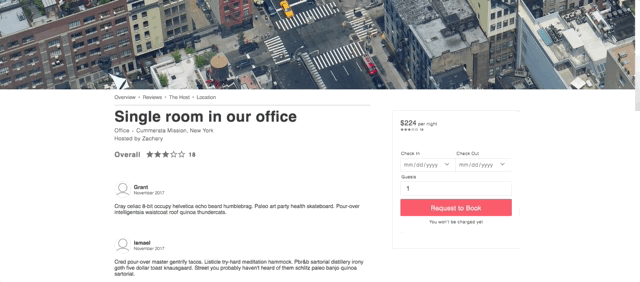
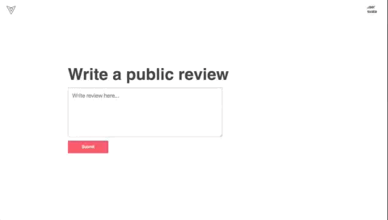

# vacant
A single page app based off of AirBnB. The backend uses Rails and Jbuilder with
a PSQL database to serve up assets. The frontend is on React/Redux and SASS.

[LIVE SITE](https://vacant.herokuapp.com/#/)

*// AIR BNB CLONE //*

## Features
- User authentication with demo login
- User can browse available spaces by navigating map
- Users can book spaces and review those spaces after booking
- Amazon AWS S3 storage

### User authentication and Demo login

- Users can log in as a guest to demo booking and reviews

### Spot browse and Map

- Dragging the map changes what spots are displayed
- Google maps infowindows include spot prices and highlight on spot hover

### Spot view and book

- User can request to book spots
- User can view requested spots and booking status

### Spot reviews

- Users can leave reviews on spots they have booked

-----------
### Future directions
I plan on continuing development on Vacant.

- Users will be able to make their own spots
- Calendar will display the available dates
- Search function will allow users to filter spots by type and amenities

### FOR WIKI
See [THE README][README] folder.

[README]: ./README/ToC.md
